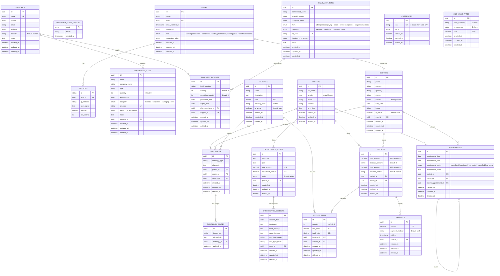

# Dental Clinic – Mermaid ER Diagram

```mermaid
erDiagram

  USERS {
    uuid id PK
    string name
    string email UK
    timestamp email_verified_at
    string password
    enum role "admin | accountant | receptionist | doctor | pharmacist | radiology-staff | warehouse-keeper"
    string remember_token
    datetime created_at
    datetime updated_at
    datetime deleted_at
  }

  PASSWORD_RESET_TOKENS {
    string email PK
    string token
    timestamp created_at
  }

  SESSIONS {
    string id PK
    uuid user_id FK
    string ip_address
    text user_agent
    longtext payload
    int last_activity
  }

  SUPPLIERS {
    uuid id PK
    string name UK
    string phone
    string email
    string address
    string country "default: Yemen"
    text notes
    datetime created_at
    datetime updated_at
    datetime deleted_at
  }

  PHARMACY_ITEMS {
    uuid id PK
    string commercial_name
    string scientific_name
    string company_name
    enum form "tablet | capsule | syrup | cream | ointment | injection | suspension | drops"
    enum category "medicine | supplement | cosmetic | other"
    string qr_code UK
    string location_in_pharmacy
    text notes
    datetime created_at
    datetime updated_at
    datetime deleted_at
  }

  WAREHOUSE_ITEMS {
    uuid id PK
    string name
    string company_name
    string type
    int quantity "default: 0"
    date expiry_date
    enum category "chemical | equipment | packaging | other"
    string qr_code UK
    string location_in_warehouse
    text notes
    uuid supplier_id FK
    datetime created_at
    datetime updated_at
    datetime deleted_at
  }

  PHARMACY_BATCHES {
    uuid id PK
    string batch_number
    int quantity "default: 0"
    int remaining_quantity "default: 0"
    date production_date
    date expiry_date
    uuid pharmacy_item_id FK
    uuid supplier_id FK
    datetime created_at
    datetime updated_at
    datetime deleted_at
  }

  PATIENTS {
    uuid id PK
    string full_name
    enum gender "male | female"
    string phone
    string address
    date birth_date
    datetime created_at
    datetime updated_at
    datetime deleted_at
  }

  SERVICES {
    uuid id PK
    string name
    text description
    decimal price "12,2"
    string currency_code "3 chars"
    boolean is_active "default: true"
    datetime created_at
    datetime updated_at
    datetime deleted_at
  }

  DOCTORS {
    uuid id PK
    string phone
    string address
    string specialty
    string degree
    enum gender "male | female"
    date birth_date
    string image
    boolean is_active "default: true"
    uuid user_id FK
    datetime created_at
    datetime updated_at
    datetime deleted_at
  }

  APPOINTMENTS {
    uuid id PK
    date appointment_date
    time appointment_time
    enum appointment_status "scheduled | confirmed | completed | cancelled | no_show"
    text appointment_notes
    uuid patient_id FK
    uuid doctor_id FK
    uuid parent_appointment_id FK
    datetime created_at
    datetime updated_at
    datetime deleted_at
  }

  RADIOLOGIES {
    uuid id PK
    string radiology_type
    text diagnosis
    uuid patient_id FK
    uuid doctor_id FK
    uuid service_id FK
    datetime created_at
    datetime updated_at
    datetime deleted_at
  }

  RADIOLOGY_IMAGES {
    uuid id PK
    string image_path
    text ai_analysis
    uuid radiology_id FK
    datetime deleted_at
  }

  ORTHODONTIC_CASES {
    uuid id PK
    text diagnosis
    text plan
    decimal total_amount "12,2"
    decimal installment_amount "12,2"
    string status "default: active"
    uuid patient_id FK
    datetime created_at
    datetime updated_at
    datetime deleted_at
  }

  ORTHODONTIC_SESSIONS {
    uuid id PK
    date session_date
    text treatment
    text teeth_changes
    text gum_changes
    string wire_type_upper
    string wire_type_lower
    uuid case_id FK
    datetime created_at
    datetime updated_at
    datetime deleted_at
  }

  INVOICES {
    uuid id PK
    decimal total_amount "12,2 default: 0"
    tinyint discount_percent "default: 0"
    decimal final_amount "12,2 default: 0"
    string payment_status "default: unpaid"
    uuid patient_id FK
    uuid doctor_id FK
    datetime created_at
    datetime updated_at
    datetime deleted_at
  }

  INVOICE_ITEMS {
    uuid id PK
    int quantity "default: 1"
    decimal unit_price "10,2"
    decimal total_price "12,2"
    uuid invoice_id FK
    uuid service_id FK
    datetime created_at
    datetime updated_at
    datetime deleted_at
  }

  PAYMENTS {
    uuid id PK
    decimal amount "12,2"
    string payment_method "default: cash"
    timestamp paid_at
    uuid invoice_id FK
    datetime created_at
    datetime updated_at
    datetime deleted_at
  }

  CURRENCIES {
    uuid id PK
    string code UK "3 chars: YER USD SAR"
    string name
    datetime created_at
    datetime updated_at
    datetime deleted_at
  }

  EXCHANGE_RATES {
    uuid id PK
    string from_currency "3 chars"
    string to_currency "3 chars"
    decimal rate "12,6"
    datetime created_at
    datetime updated_at
    datetime deleted_at
  }

  %% ── Relationships ──

  USERS ||--o{ SESSIONS : "has"
  USERS ||--o| DOCTORS : "has profile"

  SUPPLIERS ||--o{ WAREHOUSE_ITEMS : "supplies"
  SUPPLIERS ||--o{ PHARMACY_BATCHES : "supplies"

  PHARMACY_ITEMS ||--o{ PHARMACY_BATCHES : "has batches"

  PATIENTS ||--o{ APPOINTMENTS : "books"
  PATIENTS ||--o{ RADIOLOGIES : "has"
  PATIENTS ||--o{ ORTHODONTIC_CASES : "has"
  PATIENTS ||--o{ INVOICES : "billed"

  DOCTORS ||--o{ APPOINTMENTS : "attends"
  DOCTORS ||--o{ RADIOLOGIES : "performs"
  DOCTORS ||--o{ INVOICES : "issues"

  SERVICES ||--o{ RADIOLOGIES : "used in"
  SERVICES ||--o{ INVOICE_ITEMS : "line item"

  APPOINTMENTS ||--o{ APPOINTMENTS : "parent"

  RADIOLOGIES ||--o{ RADIOLOGY_IMAGES : "has images"

  ORTHODONTIC_CASES ||--o{ ORTHODONTIC_SESSIONS : "has sessions"

  INVOICES ||--o{ INVOICE_ITEMS : "contains"
  INVOICES ||--o{ PAYMENTS : "paid by"
```
