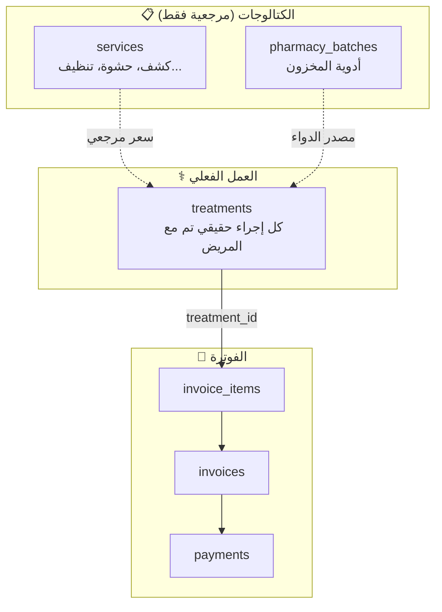
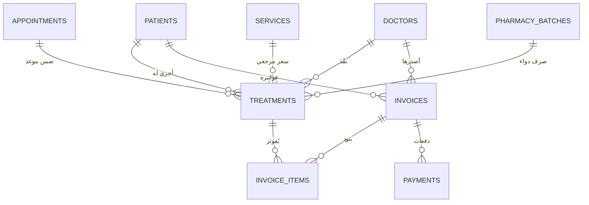

# 🧠 إعادة تصميم الفاتورة — "العمل" كنقطة وصل

## ❌ المشكلة في التصميم الحالي

`invoice_items` يشير مباشرة لـ `services` — لكن `services` هو مجرد **كتالوج أسعار**، وليس العمل الحقيقي الذي تم مع المريض.

```
الآن:     invoice_items ──► services (كتالوج)
                              ❌ أين سجل العمل الفعلي؟
                              ❌ أين صرف الدواء؟
```

---

## ✅ الحل — جدول `treatments` (العمل المُنجز)

الفكرة: كل إجراء يتم مع المريض يُسجَّل كـ "عمل" في جدول `treatments`، والفاتورة تُحاسب على الأعمال:



---

## 📐 تصميم جدول `treatments`

```php
Schema::create('treatments', function (Blueprint $table) {
    $table->uuid('id')->primary();

    // نوع العمل
    $table->enum('type', [
        'consultation',        // كشف
        'filling',             // حشوة
        'extraction',          // خلع
        'cleaning',            // تنظيف
        'cosmetic',            // تجميل
        'radiology',           // أشعة
        'orthodontic_session', // جلسة تقويم
        'pharmacy_dispense',   // صرف دواء
        'other'
    ]);

    // تفاصيل العمل
    $table->text('description')->nullable();
    $table->integer('quantity')->default(1);
    $table->decimal('unit_price', 12, 2);      // السعر الفعلي وقت التنفيذ
    $table->string('status')->default('completed');
    $table->timestamps();
    $table->softDeletes();

    // ─── العلاقات الأساسية ───
    $table->uuid('patient_id');
    $table->foreign('patient_id')->references('id')->on('patients')->onDelete('restrict');

    $table->uuid('doctor_id');
    $table->foreign('doctor_id')->references('id')->on('doctors')->onDelete('restrict');

    // ─── العلاقات الاختيارية (حسب نوع العمل) ───

    // من أي موعد؟
    $table->uuid('appointment_id')->nullable();
    $table->foreign('appointment_id')->references('id')->on('appointments')->onDelete('set null');

    // الخدمة المرجعية (للسعر الأساسي)
    $table->uuid('service_id')->nullable();
    $table->foreign('service_id')->references('id')->on('services')->onDelete('restrict');

    // دواء مصروف (عند type = pharmacy_dispense)
    $table->uuid('pharmacy_batch_id')->nullable();
    $table->foreign('pharmacy_batch_id')->references('id')->on('pharmacy_batches')->onDelete('restrict');
});
```

---

## 📐 تعديل `invoice_items` — يصبح بسيط جداً

```php
Schema::create('invoice_items', function (Blueprint $table) {
    $table->uuid('id')->primary();
    $table->integer('quantity')->default(1);
    $table->decimal('unit_price', 10, 2);
    $table->decimal('total_price', 12, 2);
    $table->timestamps();
    $table->softDeletes();

    // الفاتورة
    $table->uuid('invoice_id');
    $table->foreign('invoice_id')->references('id')->on('invoices')->onDelete('restrict');

    // العمل المُنجز — نقطة الوصل الوحيدة!
    $table->uuid('treatment_id');
    $table->foreign('treatment_id')->references('id')->on('treatments')->onDelete('restrict');
});
```

> **ملاحظة:** لم يعد هناك `service_id` ولا `pharmacy_batch_id` في `invoice_items` — فقط `treatment_id`!

---

## 🔄 سير العمل الكامل

```
مريض يحضر للعيادة
        │
        ▼
   📅 موعد (appointment)
        │
        ▼
   الطبيب يعمل عدة إجراءات → كل واحد = treatment
   ┌──────────────────────────────────────────────┐
   │ treatment 1: كشف طبيب       → service_id     │
   │ treatment 2: أشعة بانوراما  → service_id     │
   │ treatment 3: حشوة ضرس       → service_id     │
   │ treatment 4: صرف مضاد حيوي  → pharmacy_batch_id │
   └──────────────────────────────────────────────┘
        │
        ▼
   📄 إنشاء فاتورة → كل treatment يصبح invoice_item
   ┌──────────────────────────────────────────────┐
   │ بند 1: treatment_id(1) → 25,000 د.ع          │
   │ بند 2: treatment_id(2) → 40,000 د.ع          │
   │ بند 3: treatment_id(3) → 50,000 د.ع          │
   │ بند 4: treatment_id(4) → 15,000 د.ع          │
   │────────────────────────────────────────────── │
   │ المجموع: 130,000 — خصم 10% — الصافي: 117,000 │
   └──────────────────────────────────────────────┘
        │
        ▼
   💰 دفعات (payments) — نقدي/بطاقة/أقساط
```

---

## 🎯 فوائد هذا التصميم

| الميزة | الشرح |
|--------|-------|
| **نقطة وصل واحدة** | `invoice_items` → `treatment_id` فقط — لا `service_id` ولا `batch_id` |
| **سجل طبي** | كل عمل يُسجَّل مع المريض والطبيب والموعد |
| **أعمال غير مفوترة** | يمكن تسجيل العمل أولاً ثم الفوترة لاحقاً |
| **تتبع المخزون** | صرف الدواء (`pharmacy_dispense`) يُخصم من `remaining_quantity` |
| **السعر الفعلي** | `treatment.unit_price` = السعر وقت التنفيذ (قد يختلف عن الكتالوج) |
| **مرونة** | إضافة أنواع عمل جديدة بسهولة |

---

## 📊 العلاقات النهائية


